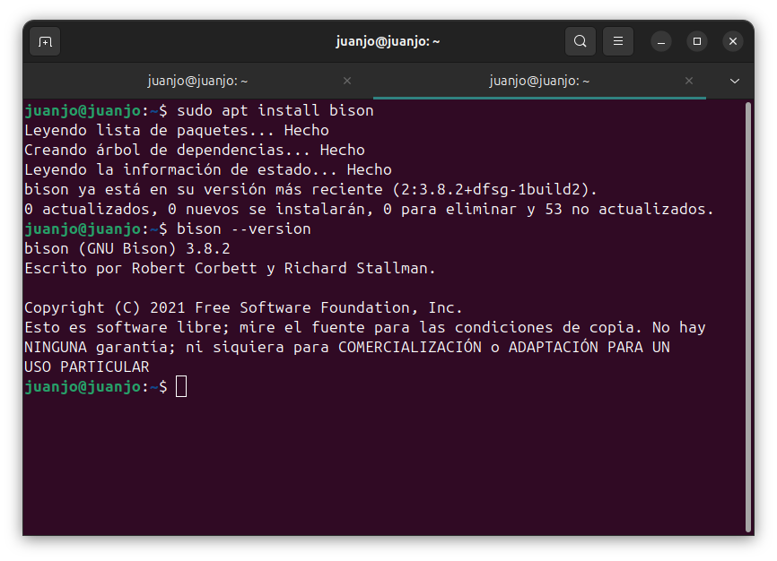
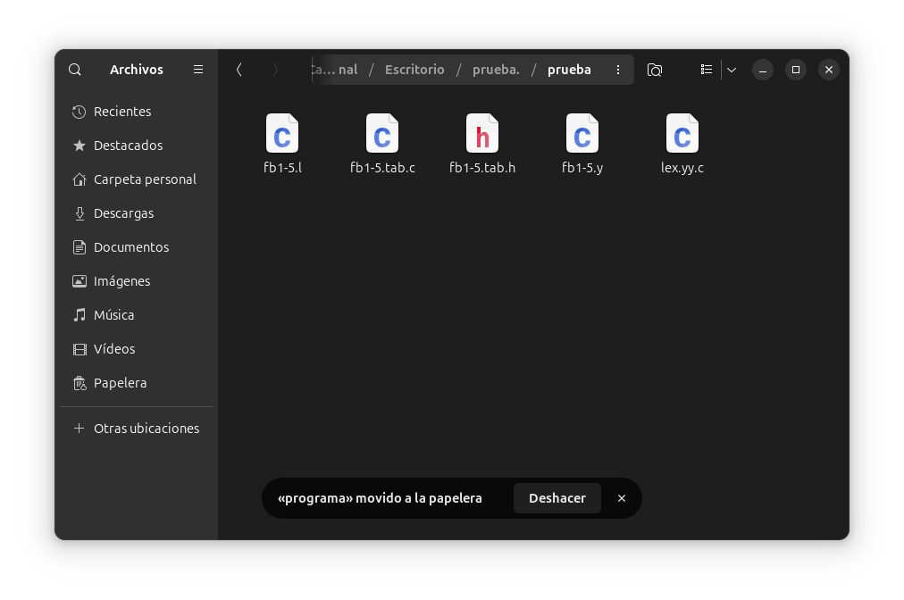
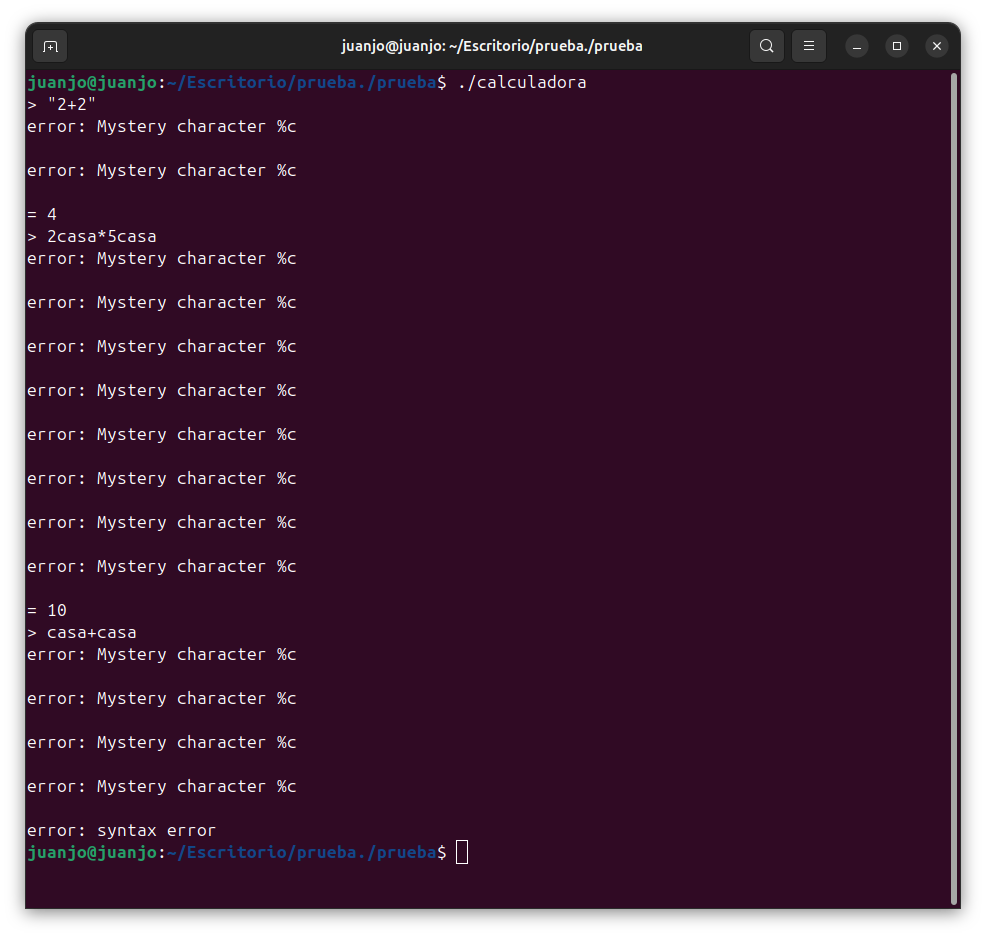
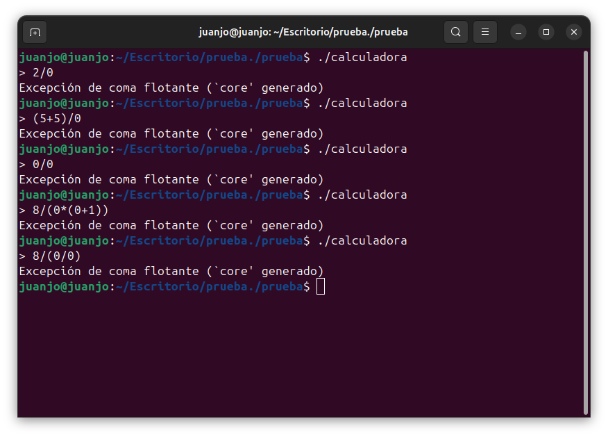
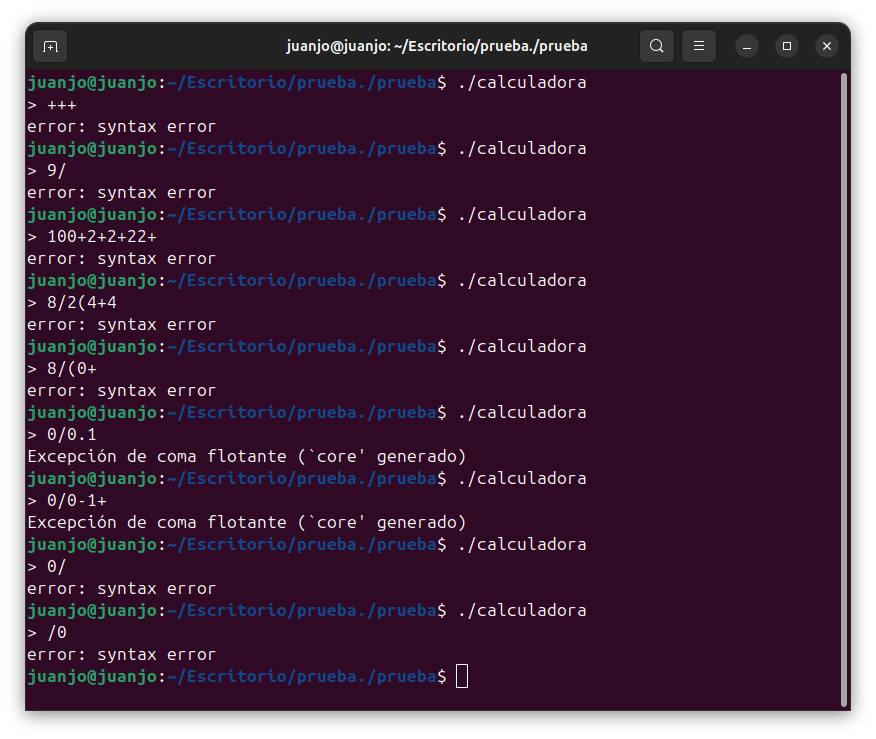

# Ejecución de calculadora con Bison
**Nombres:Miguel Fernández, Kevin García, Camilo López, Juan Márquez**
## Introducción
## 1) Instalación de Bison
Para realizar la instalación de Bison, simplemente utilizamos el comando `sudo apt install bison` desde una terminal para que este se descargue en el sistema. Si la instalación es correcta, al ejecutar el comando `bison --version`, podremos ver la versión instalada de Bison.



## 2) Ejecución de la calculadora
Para la ejecución de la calculadora, primero debemos compilarla con los archivos disponibles en la carpeta `prueba`.



Como se puede ver, son un total de 5 archivos que contienen el código para la calculadora; sin embargo, vamos a crear un ejecutable al compilar los archivos `fb1-5.tab.c` y `lex.yy.c` usando, desde una terminal, el comando `gcc -o calculadora fb1-5.tab.c lex.yy.c -lfl`.


Como podemos ver, al momento de compilar, nos da varias advertencias de errores que encuentra al compilar; pero, aun así, nos genera un archivo ejecutable, el cual se puede ejecutar desde una terminal con la carpeta abierta, usando el comando `./calculadora`.


### 2.1) Prueba de entrada
Después de verificar que la ejecución del programa es correcta, procederemos a probar el programa con varias operaciones matemáticas.


### 2.2) Manejo de errores
En este caso, estaremos probando entradas inválidas para el programa, tales como el ingreso de caracteres, la división por 0 y las operaciones incompletas.

Comenzaremos con el ingreso de caracteres entre las operaciones y también las operaciones entre caracteres.



Como podemos ver, el ingreso de caracteres entre operaciones no afecta el resultado; sin embargo, se informa la presencia de caracteres no identificados, y en caso de no haber números, se finaliza el programa debido a un `syntax error`.

Ahora haremos una sencilla prueba al realizar una división por cero y también al intentar ejecutar una operación incompleta.



Como podemos ver, al intentar dividir entre cero, siempre nos da el mismo resultado de error y finalización del programa, sin importar cómo varíe la operación para intentar evitar esto.



En este caso, vemos también que el resultado de una operación incompleta siempre es el mismo; pero también está el caso donde, a pesar de estar incompleta la operación, la salida es diferente, como en la operación con un cero. En este caso, la operación de división estaba completa, pero había signos de más que dejaban la operación total incompleta, lo que nos puede indicar una jerarquía sobre el manejo de errores por parte de la calculadora.

### 2.3) Verificación de salida
La calculadora da una salida correcta a las operaciones que se le ingresan, así incluyan paréntesis o no. Incluso se usó una operación con un resultado ambiguo, y dio el resultado que la mayoría de calculadoras de equipos electrónicos dan, lo que nos permite decir que los cálculos realizados por el programa son correctos.

## 3) Explicación 
### 3.1) Tokenización
El lexer (fb1-5.l) define las reglas de tokenización, esto es, cómo convertir las partes de la entrada en tokens. En este caso, tenemos las siguientes declaraciones de reglas

```
%%
"+"	{ return ADD; }
"-"	{ return SUB; }
"*"	{ return MUL; }
"/"	{ return DIV; }
"|"     { return ABS; }
"("     { return OP; }
")"     { return CP; }
[0-9]+	{ yylval = atoi(yytext); return NUMBER; }

\n      { return EOL; }
"//".*  
[ \t]   { /* ignore white space */ }
.	{ yyerror("Mystery character %c\n", *yytext); }
%%
```

1. Se definen los operadores aritméticos `+, -, *, /`, los cuales se reconocen directamente y se devuelve un token específico para cada uno: `ADD, SUB, MUL, DIV` respectivamente.
2. Se define el operador valor absoluto `|`, el cual devuelve el token `ABS`.
3. Se definen los paréntesis `(` y `)` los cuales devuelven los tokens `OP (Open Parenthesis)` y `CP (Close Parenthesis)`, respectivamente. Estos son esenciales para manejar la jerarquía y agrupación de operaciones en una expresión dada.
4. 

### 3.2) Análisis
### 3.3) Evaluación
